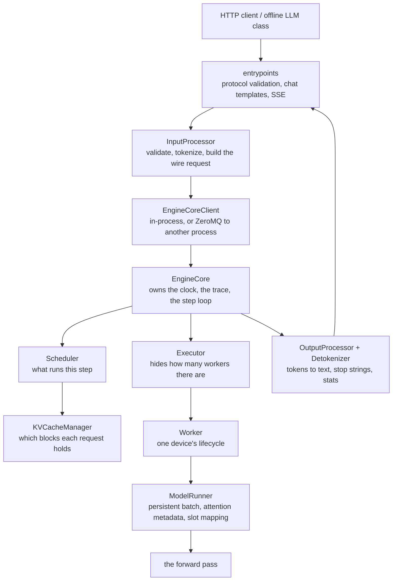

# 02. The vLLM V1 architecture

> **Files:** the whole of [`pvllm/v1/`](../../pvllm/v1) and [`pvllm/entrypoints/`](../../pvllm/entrypoints) — this chapter is the map, later chapters are the territory.
> **Upstream:** `vllm/v1/`, `vllm/entrypoints/`
> **Prerequisites:** chapters [00](00-orientation.md), [01](01-llm-inference-fundamentals.md).

## The layers

A request travels down through these and its results travel back up. Each box owns one
thing, and the boundaries are where the interesting design decisions live.



## Who owns what

| Layer | Owns | Does *not* own |
|---|---|---|
| **entrypoints** | HTTP schemas, chat templates, SSE framing, per-endpoint semantics | tokenization policy, scheduling, time |
| **InputProcessor** | validation, tokenization, `max_model_len` checks | the clock (upstream reads one here; this port does not — see below) |
| **EngineCoreClient** | transport to the core: in-process call or ZeroMQ frames | any engine logic |
| **EngineCore** | the step loop, **the clock**, the trace, request admission | what runs (that is the scheduler's) |
| **Scheduler** | which requests run, how many tokens each gets, who gets preempted | how long anything takes |
| **KVCacheManager** | block allocation, prefix cache lookup, free order | scheduling policy |
| **Executor** | fan-out across workers | device details |
| **Worker** | device lifecycle: init, load, profile, warm up, execute | scheduling, request state |
| **ModelRunner** | the persistent batch, input prep, attention metadata, slot mapping | which requests exist |
| **OutputProcessor** | detokenization, stop strings, per-request stats | token-level stop conditions (the scheduler's) |

Three of those boundaries are worth memorising because they explain most of the code:

1. **The scheduler decides *what*, the device decides *how long*.** The scheduler never
   reads a clock. This is why a virtual clock is possible at all, and why swapping the
   cost model cannot change a single scheduling decision.
2. **The KV cache manager decides *which blocks*, the scheduler decides *whether to
   ask*.** `allocate_slots` returning `None` means "does not fit right now" — a
   scheduling outcome, not an error. That single return convention is what makes
   preemption a loop instead of an exception path.
3. **The engine core owns the clock and nothing above it reads one.** In-process that
   looks like a stylistic choice. Across a process boundary it is the difference between
   one timeline and two.

## The step loop

This is the whole engine, in seven lines. From
[`pvllm/v1/engine/core.py`](../../pvllm/v1/engine/core.py):

```python
def step(self):
    planned = self._plan_step()            # scheduler decides; core stamps SCHEDULED
    if planned is None:
        return {}, False                   # nothing to do
    self._transfer_kv(planned)             # pull externally-held KV, charge the clock
    return self._finish_step(planned, self.executor.execute_model(planned))
```

and inside `_finish_step`, the essential line:

```python
engine_core_outputs = self.scheduler.update_from_output(scheduler_output, model_output)
```

**schedule → execute → update.** Every feature in this repository is a modification of
one of those three verbs. Chunked prefill changes *schedule*. Speculative decoding
changes *execute* and *update*. Prefix caching changes what *schedule* has to allocate.
KV disaggregation adds a step before *execute*.

## The two objects that cross the boundary

Between the control plane and the device there are exactly two data structures, and
knowing their shapes is most of knowing the engine.

### `SchedulerOutput` — the decision

[`pvllm/v1/core/sched/output.py`](../../pvllm/v1/core/sched/output.py). The important
fields:

```python
scheduled_new_reqs: list[NewRequestData]      # never seen by the worker before
scheduled_cached_reqs: CachedRequestData      # parallel arrays, an incremental diff
num_scheduled_tokens: dict[str, int]          # req_id -> tokens this step
total_num_scheduled_tokens: int               # must not exceed max_num_batched_tokens
finished_req_ids: set[str]                    # worker should drop this state
preempted_req_ids: set[str] | None
num_common_prefix_blocks: list[int]           # per KV group, for cascade attention
scheduled_spec_decode_tokens: dict[str, list[int]]
scheduled_encoder_inputs: dict[str, list[int]]
grammar_bitmask: ndarray | None
```

Two design notes that are easy to miss:

- `scheduled_cached_reqs` is **one object holding parallel arrays**, not a list of
  per-request objects. That shape is what makes the worker's batch update an incremental
  diff rather than a rebuild — index `i` of every array refers to `req_ids[i]`.
- Only tokens the worker has **not seen** travel on the wire. The worker already holds
  everything up to `num_computed_tokens`.

### `ModelRunnerOutput` — the result

[`pvllm/v1/outputs.py`](../../pvllm/v1/outputs.py):

```python
req_ids: list[str]
req_id_to_index: dict[str, int]
sampled_token_ids: list[list[int]]     # inner list len > 1 only under speculation
logprobs: LogprobsLists | None
spec_token_ids: list[list[int]] | None # drafts for the *next* step
pooler_output: list[list[float] | None] | None
modeled_duration: float                # this project's one addition
```

`sampled_token_ids[i]` being a *list* is not a quirk: under speculative decoding one step
can return several accepted tokens for one request. Everything downstream handles
multi-token appends because of it.

## What is different about V1

If you have read older vLLM material, or blog posts from 2023–2024, these are the changes
that matter most. All of them are reflected in this port.

| V0 | V1 (v0.27.1, what this port mirrors) |
|---|---|
| `SequenceGroup`, `Sequence`, sequence-level bookkeeping | a flat `Request` with `num_computed_tokens` / `num_tokens` |
| explicit prefill and decode phases, separate scheduling paths | one path: hand out tokens until computed catches up |
| `n > 1` handled inside the engine as a sequence group | `n > 1` fanned out in the **frontend** into *n* independent requests sharing a prompt via the prefix cache |
| chunked prefill and prefix caching opt-in | both **on by default** |
| scheduler output as a bundle of sequence metadata | `SchedulerOutput` with parallel arrays and an incremental diff |
| the engine and the API server in one process | engine core in its **own process** by default upstream, talking msgpack over ZeroMQ |
| one monolithic model runner | V2 runner (`vllm/v1/worker/gpu/`) with an explicit method decomposition, default for dense generate models |

The `n > 1` change is a good example of V1's philosophy: rather than teach the scheduler
about groups of sequences, make four requests. They queue independently, they get
preempted independently, and they share the prompt's KV through the *ordinary* prefix
cache. The engine stays simple and the behaviour is more realistic. See
[`parallel_sampling.py`](../../pvllm/v1/engine/parallel_sampling.py) and chapter
[07](07-requests-and-sampling.md).

## Where this port deviates, structurally

Only three deviations affect the *architecture* (the rest are "not implemented, refuses
by name"). All three are deliberate and documented at their call sites.

**1. Clock ownership.** Upstream stamps `arrival_time` in the frontend with
`time.time()`. Here the frontend has no clock at all: `EngineCoreRequest.arrival_time` is
optional and the engine core stamps it on receipt. Without this, running the core in
another process would silently mix two timelines and every latency metric would become
the sum of two unrelated clocks. → chapter [16](16-clock-and-determinism.md)

**2. The `none_hash` sentinel.** Upstream seeds the prefix cache's "no parent block"
sentinel from `os.urandom(32)` so cache keys are unpredictable across processes. That
would make block hash values differ on every run, which breaks reproducibility. Here it
is derived from the run seed. → chapter [10](10-prefix-caching.md)

**3. Multiprocessing defaults off.** Upstream defaults `VLLM_ENABLE_V1_MULTIPROCESSING`
on because it buys overlap with the GPU. Here there is no GPU to overlap with, and it
costs byte-identical determinism, so it is opt-in. → chapter
[18](18-multiprocess-engine.md)

## Reading the real thing alongside this

The mirroring is close enough that this is a practical study technique:

```bash
python tools/fetch_upstream.py          # ~36 MB into vendor/, gitignored
diff vendor/vllm-0.27.1/vllm/v1/core/block_pool.py pvllm/v1/core/block_pool.py
```

Tier A modules (see chapter [03](03-simulation-boundary.md)) are line-for-line
comparable: same method names, same order of operations, same branch structure. Tier B
modules share the public API but have thinner bodies. Reading the diff for
`block_pool.py` or `kv_cache_utils.py` is one of the fastest ways to learn what upstream
actually does.

## Check yourself

- Name the three verbs of the step loop, and one feature that modifies each.
- Why does `allocate_slots` return `None` instead of raising?
- Why is `scheduled_cached_reqs` parallel arrays rather than a list of objects?
- Where does `n > 1` get expanded, and why there rather than in the scheduler?
- Which component reads the clock, and what breaks if a second one does?

## Next

[03. The simulation boundary](03-simulation-boundary.md) — exactly where real stops and
fake starts, and how that line is defended.
