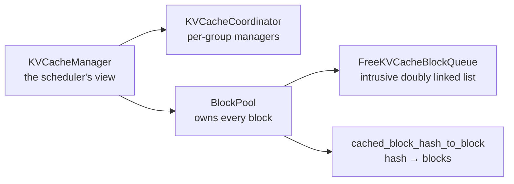

# 09. KV cache blocks

> **Files:** [`pvllm/v1/core/kv_cache_utils.py`](../../pvllm/v1/core/kv_cache_utils.py), [`pvllm/v1/core/block_pool.py`](../../pvllm/v1/core/block_pool.py), [`pvllm/v1/core/kv_cache_manager.py`](../../pvllm/v1/core/kv_cache_manager.py)
> **Upstream:** the same three paths under `vllm/v1/core/` — all Tier **A**
> **Prerequisites:** chapter [01](01-llm-inference-fundamentals.md) (why KV is big), chapter [07](07-requests-and-sampling.md).
> **Contract:** C2 — *block allocation and free order* must match upstream exactly.

This is PagedAttention as the engine actually experiences it: not a kernel, but three
data structures and one rule about ordering.

## The problem, restated with numbers

A `dense-8b` request costs 128 KiB of KV per token (chapter
[01](01-llm-inference-fundamentals.md)). Reserving `max_model_len = 131072` per request
means **16 GiB reserved for every request** — three requests and an 80 GiB card is full,
even if each generates twelve tokens. (That is not a rhetorical figure: chapter
[14](14-memory-model.md) computes `max_concurrency = 3.54x` for exactly this configuration.)

The fix is the one every operating system made decades ago: stop reserving contiguous
ranges, and page it.

- The KV cache is a pool of `num_gpu_blocks` fixed-size **blocks**, each holding
  `block_size` (default 16) tokens of KV **for one layer group**.
- A request holds a **block table** — an ordered list of block ids — grown one block at a
  time as it generates.
- Token *i* of a request lives at block `table[i // 16]`, slot `i % 16`.

Internal waste drops from "the whole unused reservation" to "at most 15 tokens in the last
block", and blocks become shareable, which is what chapter [10](10-prefix-caching.md) is
built on.

## Three data structures



### `KVCacheBlock` — one block's metadata

```python
@dataclass
class KVCacheBlock:
    block_id: int  # 0 .. num_gpu_blocks-1
    ref_cnt: int = 0  # how many requests hold it
    _block_hash: BlockHashWithGroupId | None = None  # set when full and cached
    prev_free_block: KVCacheBlock | None = None  # ← the free-list links live here
    next_free_block: KVCacheBlock | None = None
    is_null: bool = False  # the shared placeholder
```

`ref_cnt == 0` means the block is in the free queue and may be evicted. Non-zero means at
least one request holds it. **The links live on the block itself**, which is the next point.

### `FreeKVCacheBlockQueue` — an intrusive doubly linked list

Not a `deque`, and the comment in the source is emphatic that this is not an optimisation
detail:

> A block hit by a second request must be removable from the middle of the free queue in
> O(1) (`touch`), and a `deque` cannot do that. Change the data structure and the
> allocation trace changes with it.

The scenario: a block sits in the free queue as an eviction candidate. A new request's
prefix hits it. It must gain a reference *and* leave the queue — from wherever it happens
to be. `remove()` does that in constant time because the block knows its neighbours.

Sentinel head and tail nodes remove the boundary branches, so every real block always has
both neighbours. No Python objects are allocated while manipulating the list, which matters
because it is touched on every allocation and every free of every step.

Five operations, and their positions are all meaningful:

| Operation | Where | Why |
|---|---|---|
| `popleft` / `popleft_n` | front | least recently freed → evicted first |
| `append` / `append_n` | back | freed blocks *with* a hash stay available longest |
| `prepend_n` | **front** | freed blocks *without* a hash can never produce a hit, so spend them first |
| `remove` | anywhere, O(1) | a cached block being re-referenced |

### `BlockPool` — ownership and eviction

```
def get_new_blocks(self, num_blocks) -> list[KVCacheBlock]:   # pop from the front
def touch(self, blocks) -> None:                              # re-reference a cached block
def free_blocks(self, ordered_blocks) -> None:                # drop a reference
def get_cached_block(self, block_hash, group_id) -> KVCacheBlock | None
def cache_full_blocks(...) -> None
def get_usage(self) -> float                                  # → vllm:kv_cache_usage_perc
def reset_prefix_cache(self) -> bool
```

## The ordering rule that C2 is really about

Two behaviours carry the whole contract, and both are about *order*, not counts.

### 1. A request's blocks are freed **tail-first**

`free_blocks` takes blocks already sorted by eviction priority. `KVCacheManager.free`
reverses a request's block chain before calling it, so the **tail** of the sequence is
evicted first and the **head** survives longest.

That is the entire point of a prefix cache: the head of a sequence is the part another
request is most likely to share. Free head-first and every count still balances while the
hit rate collapses — a bug that looks like a tuning problem rather than a correctness one.

### 2. Unhashed blocks are prepended, hashed blocks appended

```python
self.free_block_queue.prepend_n(blocks_without_hash)  # spend these first
self.free_block_queue.append_n(blocks_with_hash)  # keep these as long as possible
```

A block with no hash — a partial tail block, for instance — can never produce a cache hit,
so evicting it ahead of hashed blocks costs nothing and preserves more cache. Get this
backwards and, again, hit rate collapses while nothing looks broken.

You can see both rules in three lines:

```bash
python -c "
from pvllm.v1.core.block_pool import BlockPool
pool = BlockPool(num_gpu_blocks=8, enable_caching=True)
a = pool.get_new_blocks(3)
print('allocated ', [b.block_id for b in a], 'free:', pool.get_num_free_blocks())
pool.free_blocks(reversed(a))                       # tail-first, as the manager does
print('free queue', [b.block_id for b in pool.free_block_queue.get_all_free_blocks()])
print('next alloc', [b.block_id for b in pool.get_new_blocks(2)])
"
```

```
allocated  [0, 1, 2] free: 5
free queue [2, 1, 0, 3, 4, 5, 6, 7]
next alloc [2, 1]
```

Blocks 0–2 carried no hash (they were never full), so they went to the **front** and were
handed straight back out. Blocks 3–7, never allocated, sit behind them.

## `KVCacheManager` — the scheduler's view

The scheduler never sees a `KVCacheBlock`. It sees block **ids**, wrapped in
`KVCacheBlocks`:

```
@dataclass
class KVCacheBlocks:
    blocks: tuple[list[KVCacheBlock], ...]     # blocks[group][index]
    def get_block_ids(self, allow_none=False) -> tuple[list[int], ...] | None
```

Groups are the *outer* dimension from the start, even for a dense model with one group.
Retrofitting groups later would mean touching every block-id call site in the scheduler and
the runner — chapter [11](11-hybrid-kv-groups.md).

Four methods, and `allocate_slots` is the one to know:

```
def get_computed_blocks(self, request) -> tuple[KVCacheBlocks, int]   # chapter 10
def allocate_slots(self, request, num_new_tokens, ...) -> KVCacheBlocks | None
def remove_skipped_blocks(self, request) -> None                     # chapter 11
def free(self, request) -> None
```

### `allocate_slots`, in upstream's order

```
1. Work out how many new blocks are needed, across every group.
2. FAIL EARLY if the pool cannot cover it — return None before touching anything.
3. Touch the cached blocks (take a reference, pull them out of the free queue).
4. Pop the new ones from the free queue head.
5. Publish any block that just became full to the cache.
```

Step 2 is the one to internalise. **Returning `None` rather than raising is what makes
preemption a loop rather than an exception path** — the scheduler reads it as "does not fit
right now", preempts a victim, and tries again (chapter [12](12-scheduler.md)).

And the order matters: a *partial* allocation would leave the request holding blocks it
cannot use while starving the request that could have used them.

Step 5 happens immediately on allocation, not when the request finishes. A block whose
contents are complete can be shared *now*, and waiting until the request ends would miss
every hit from a concurrent request with the same prefix — which is the case a prefix cache
mostly exists to serve.

Never reserve past the length cap, either:

```python
num_tokens_needing_slots = min(
    num_computed_tokens + num_new_tokens + num_lookahead_tokens,
    self.max_model_len,
)
```

A request at `max_model_len` needs no further slots, and rounding up past it would allocate
a block that can never be written.

## Try it: watch two requests share

```python
from pvllm.v1.kv_cache_interface import (
    FullAttentionSpec,
    KVCacheConfig,
    KVCacheGroupSpec,
)
from pvllm.v1.core.kv_cache_manager import KVCacheManager
from pvllm.v1.request import Request
from pvllm.sampling_params import SamplingParams

spec = FullAttentionSpec(
    block_size=16, num_kv_heads=8, head_size=128, dtype="bfloat16", dtype_bytes=2
)
cfg = KVCacheConfig(
    num_blocks=20,
    kv_cache_groups=[KVCacheGroupSpec(layer_names=["l0"], kv_cache_spec=spec)],
)
m = KVCacheManager(cfg, max_model_len=1024, enable_caching=True)


def make(rid, toks):
    return Request(
        request_id=rid,
        prompt_token_ids=toks,
        sampling_params=SamplingParams(max_tokens=4),
        arrival_time=0.0,
        block_hasher=m.block_hasher,
    )


shared = list(range(1000, 1048))  # 48 tokens = exactly 3 blocks

r1 = make("r1", shared + [7, 7, 7, 7])  # 52 tokens
blocks, hit = m.get_computed_blocks(r1)
print("r1 hit:", hit)
print(
    "r1 blocks:",
    m.allocate_slots(
        r1, r1.num_tokens, num_new_computed_tokens=hit, new_computed_blocks=blocks
    ).get_block_ids(),
)

r2 = make("r2", shared + [9, 9, 9, 9])  # same prefix, different tail
blocks2, hit2 = m.get_computed_blocks(r2)
print("r2 hit:", hit2, "reusing", [b.block_id for b in blocks2.blocks[0]])
print(
    "r2 new blocks:",
    m.allocate_slots(
        r2,
        r2.num_tokens - hit2,
        num_new_computed_tokens=hit2,
        new_computed_blocks=blocks2,
    ).get_block_ids(),
)
print("pool free:", m.block_pool.get_num_free_blocks())
print(m.make_prefix_cache_stats().as_dict())
```

```
r1 hit: 0
r1 blocks: ([0, 1, 2, 3],)
r2 hit: 48 reusing [0, 1, 2]
r2 new blocks: ([4],)
pool free: 15
{'prefix_cache_queries': 104, 'prefix_cache_hits': 48,
 'prefix_cache_hit_rate': 0.46, 'prefix_cache_evictions': 0, 'prefix_cache_cached_blocks': 3}
```

Two 52-token requests cost **five** blocks instead of eight, and the second one prefilled
four tokens instead of 52.

## The invariants, and where they are checked

`BlockPool._check_invariants` runs when `PVLLM_DEBUG_INVARIANTS` is set — which the whole
test suite does:

```python
assert num_free == self.free_block_queue.num_free_blocks  # counter matches the list
assert num_free + allocated == self.num_gpu_blocks  # nothing lost
for block in free_blocks:
    assert block.ref_cnt == 0  # free ⇒ unreferenced
assert 0.0 <= self.get_usage() <= 1.0
```

These are the cheapest place to catch a KV manager bug: a violation here points at the
allocation that broke it, whereas the same bug found later surfaces as a wrong answer with
no trail back. Errors are worded to say what went wrong, not just that something did:

```
block 7 freed more times than it was allocated (ref_cnt=-1); a request freed blocks it did not own
```

## The null block

When any KV group *sheds* blocks — a sliding window, or a recurrent state — block 0 is
reserved as a shared **null block**: a placeholder a request's block table points at once a
real block has fallen out of the window and been freed. The table must keep its length,
because positions index into it; a shorter table would renumber every token after the
evicted one.

It is pinned (`ref_cnt = 1`, `is_null = True`) so it can never be handed out or evicted, and
it is reserved **only when something needs it** — doing it unconditionally would shift every
block id by one in every configuration, which changes nothing about behaviour and everything
about a recorded trace. Chapter [11](11-hybrid-kv-groups.md).

## Try it: introspect a live pool

With a server running and `--enable-debug-endpoints`:

```bash
curl -s localhost:8000/debug/blocks | python -m json.tool
```

That reports the actual block pool: total, free, usage, and which requests hold which
blocks.

## Check yourself

- Why is the free list intrusive rather than a `deque`? Name the operation that forces it.
- A request holds blocks `[4, 9, 2]`. In what order does the manager free them, and why?
- Why are unhashed blocks put at the *front* of the free queue?
- `allocate_slots` returns `None`. What does the scheduler do, and why is that better than
  an exception?
- Why is a block published to the cache at allocation time rather than at request end?

## Next

[10. Prefix caching](10-prefix-caching.md) — how a block gets an identity, and why the
hash chains.
