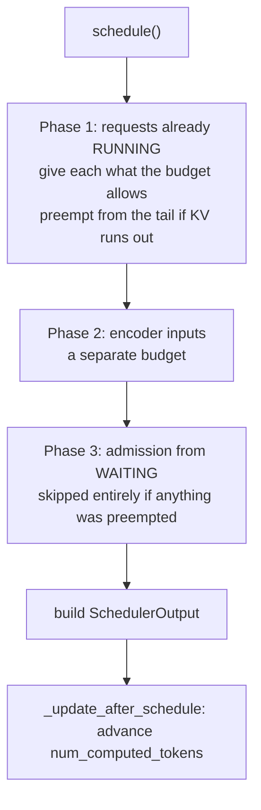

# 12. The scheduler

> **Files:** [`pvllm/v1/core/sched/scheduler.py`](../../pvllm/v1/core/sched/scheduler.py), [`sched/output.py`](../../pvllm/v1/core/sched/output.py), [`sched/request_queue.py`](../../pvllm/v1/core/sched/request_queue.py)
> **Upstream:** `vllm/v1/core/sched/scheduler.py` (Tier **A**, ~2,900 lines upstream)
> **Prerequisites:** chapters [09](09-kv-cache-blocks.md), [10](10-prefix-caching.md).
> **Contract:** C1 (decision sequence per step, total steps to drain a workload) and C4 (preemption count and victim selection).

This is the centerpiece. Every other component exists to let this one make a decision each
step, and every observable behaviour of a serving engine — TTFT under load, whether a long
prompt stalls everyone, what happens when memory runs out — is decided here.

## The one idea

> **There is no prefill phase and no decode phase.**

Every request has `num_computed_tokens` and `num_tokens`. Each step hands out tokens so the
former catches up to the latter. That is the whole model.

```python
num_new_tokens = request.num_tokens_with_spec - request.num_computed_tokens
```

| Request state | `num_new_tokens` | What it looks like |
|---|---|---|
| new, 500-token prompt | 500 | a prefill |
| new, 30,000-token prompt, budget 8,192 | 8,192 (capped) | a prefill *chunk* |
| mid-generation | 1 | a decode |
| mid-generation, 3 drafts in hand | 4 | a speculative verify |
| prompt 80% cached | 100 of 500 | a mostly-free prefill |

Chunked prefill, prefix caching, and speculative decoding all fall out of that one
expression rather than needing their own modes. **A scheduler written around a
prefill/decode split cannot reproduce upstream's traces no matter how carefully the rest is
ported.**

## `schedule()` — three phases, in an order that matters



**Running requests are served before new ones are admitted.** Not arbitrary: serving
in-progress work first is what bounds latency for requests a client is already waiting on.
Reverse the order and a stream of new arrivals starves them — and every trace changes.

Two budgets are spent as the phases run:

```python
token_budget   = self.max_num_scheduled_tokens     # max_num_batched_tokens, default 8192
encoder_budget = self.max_num_encoder_input_tokens # separate, chapter 23
# and separately bounded:  len(self.running) <= max_num_seqs   (default 1024)
```

Both are asserted at the end of every step, because exceeding either is a contract
violation:

```python
assert total_num_scheduled_tokens <= self.max_num_scheduled_tokens
assert len(self.running) <= self.max_num_running_reqs
```

### Phase 1: the running loop

For each running request, in order:

```python
num_new_tokens = request.num_tokens_with_spec - request.num_computed_tokens
if 0 < threshold < num_new_tokens:
    num_new_tokens = threshold                       # long_prefill_token_threshold
num_new_tokens = min(num_new_tokens, token_budget)
num_new_tokens = min(num_new_tokens, self.max_model_len - request.num_computed_tokens)
if num_new_tokens <= 0:
    req_index += 1
    continue                                          # ← continue, not break
```

That `continue` is deliberate: a later request may still be schedulable, and upstream
relaxes strict FCFS here.

Then allocation, with the loop that is the whole of preemption:

```python
while True:
    new_blocks = self.kv_cache_manager.allocate_slots(request, num_new_tokens)
    if new_blocks is not None:
        break
    victim = self.running.pop()          # FCFS: the most recently admitted
    self._preempt_request(victim)
    preempted_reqs.append(victim)
    if victim is request:
        break                            # preempted ourselves; nothing left to give up
```

### Phase 3: admission

```python
if not preempted_reqs:                   # ← the whole phase is skipped after a preemption
    while self.waiting and token_budget > 0:
        ...
```

**Skipping admission entirely after any preemption** is one of those rules that reads as a
detail and is not: the pool is already oversubscribed, so admitting more would preempt the
requests just preempted — thrashing instead of draining.

Inside the loop, in order: the `max_num_seqs` check, the partial-prefill cap, the LoRA slot
check, the grammar-ready check, the prefix cache lookup, the external KV lookup, the token
cap, the encoder trim, then `allocate_slots`.

Two of those checks *set the request aside* rather than breaking the loop:

- **no free LoRA slot** — a request behind it may want an adapter that *is* resident, and
  stopping here would let one tenant's queue block every other tenant's (chapter
  [22](22-lora.md));
- **grammar still compiling** — one slow schema must not block every request behind it,
  which is the whole reason compilation is asynchronous (chapter
  [21](21-structured-output.md)).

They go to a separate `skipped_waiting` queue and are restored to the **head** of the waiting
queue before the step ends, so the next step reconsiders them without them losing their place.

## Chunked prefill

Two knobs, and they solve two different problems.

**`max_num_batched_tokens`** caps the whole step. A 30,000-token prompt against a budget of
8,192 gets 8,192 tokens this step and continues next step. Decodes ride along in the same
batches, so nobody's inter-token latency collapses while a long prompt is processed.

**`max_num_partial_prefills`** (default 1) caps how many requests may be mid-prefill at once:

> Without it, a burst of long prompts all start chunking together and each one's first token
> waits for every other prompt to finish prefilling — the batch stays busy while every TTFT
> gets worse.

**`long_prefill_token_threshold`** (default 0 = off) caps any single request's share of a
step, so one very long prompt cannot monopolise a step and stall every decode behind it.

And with chunking *off*, the whole prompt must fit in one step:

```python
if not self.scheduler_config.enable_chunked_prefill and num_new_tokens > token_budget:
    break     # it may fit in a later step, so stop rather than skip
```

`request.is_prefill_chunk` is maintained in `_update_after_schedule` and read in two places
that matter: the partial-prefill cap, and the structured-output row assignment (a request on
a non-final chunk samples no token, so constraining it would consume a grammar position for
a token that never exists).

## Preemption by recompute

```python
def _preempt_request(self, request) -> None:
    self.kv_cache_manager.free(request)
    request.status = RequestStatus.PREEMPTED
    request.num_computed_tokens = 0
    request.num_preemptions += 1
    request.spec_token_ids = []           # drafts were made against KV it no longer has
    self.waiting.prepend_request(request) # ← the FRONT of the queue
```

Everything the request computed is thrown away — its blocks return to the pool and
`num_computed_tokens` resets to zero. That is what "by recompute" means: no KV is swapped
out, it is simply recomputed on resume. **The output tokens already produced are kept**, so
the request resumes mid-generation rather than restarting.

Back to the **front** of the waiting queue: sending it to the back would let newer arrivals
overtake it indefinitely.

### Victim selection (C4)

| Policy | Victim |
|---|---|
| `fcfs` | `self.running.pop()` — the **last** running request: most recently admitted, has computed the least, so recompute wastes the least |
| `priority` | `max(self.running, key=lambda r: (r.priority, r.arrival_time))` — lowest priority, ties broken by latest arrival |

Under `priority`, if the victim was already scheduled this step, its tokens and blocks are
rolled back out of the decision — including its encoder reservation, so the step is not
charged vision-encoder time for a request it did not run.

Resumed requests are handed to the worker as **new**, not cached:

```python
scheduled_new_reqs.extend(scheduled_resumed_reqs)
```

because the V2 runner rebuilds a resumed request's state from scratch. Sending them as
cached would ask the worker to patch state it discarded. And `NewRequestData.prefill_token_ids`
carries prompt *plus everything generated so far* — send only the prompt and the runner
believes the request has generated nothing, re-samples from position 0, and the client
receives a token it has already been given.

## The queues

[`request_queue.py`](../../pvllm/v1/core/sched/request_queue.py) — the queue's ordering **is**
the admission order, so it is part of C1.

`FCFSRequestQueue` is a `deque`, with `prepend_request` = `appendleft` for preemption.

`PriorityRequestQueue` is a heap keyed by `(priority, arrival_time, request_id, request)`.
The `request_id` tiebreak is what makes the order **total**, and therefore what makes C1
reproducible: under a virtual clock many requests share an arrival instant, so without it the
admission order would depend on heap internals. Note also that a priority queue has no
"front" to prepend to — a preempted request returns to wherever its priority puts it, which is
upstream's behaviour too.

Its `__iter__` sorts a copy rather than walking the heap array, which is only partially
ordered — iterating the raw array gives an order that looks right for small queues and
silently is not for large ones.

## `update_from_output()` — folding results back

```python
for request in self.running:
    generated = sampled_token_ids[index]              # may be several tokens
    # 1. roll back rejected drafts
    # 2. append tokens ONE AT A TIME, checking stop after each
    # 3. build an EngineCoreOutput if anything happened
# then, for every still-running request:
#   4. release blocks the window/state no longer needs
#   5. free finished encoder inputs
#   6. store the drafts proposed for the NEXT step
```

Three details you will care about:

**Draft rollback.** A step schedules `1 + num_drafts` tokens and gets back
`1 + num_accepted`. The difference was computed against rejected drafts, so it comes back off
`num_computed_tokens` — otherwise the count runs ahead of the request's actual history and the
next step schedules a *negative* number of tokens, "which is a loop that never terminates
rather than an error that says anything".

**One token at a time.** `_update_request_with_output` appends and checks `check_stop` after
each token, trimming the batch the moment one hits. A request that stops on its second of
three sampled tokens must not emit the third.

**Order of operations.** Window eviction and encoder frees happen *after* the rollback,
because scheduling inflated the count by the drafts it was about to verify. Chapter
[11](11-hybrid-kv-groups.md) explains why evicting on the inflated boundary is cross-request
KV corruption.

## Aborts

```python
def finish_requests(self, request_ids, finished_status) -> None:
```

Called from outside the step loop — a disconnected client, typically. **The blocks are freed
within the same step**, so a disconnected client's capacity comes back immediately rather
than at the end of its generation. Chapter [17](17-engine-core-and-frontends.md) covers the
cancellation path that leads here; it is the behaviour whose absence is invisible until
capacity runs out under real traffic.

## What the scheduler does *not* do

- **Read a clock.** It has none. It collects the requests it admitted into
  `pending_scheduled` and the engine core stamps them. Same for the step trace record: the
  scheduler builds it, the core dates it.
- **Know how long anything takes.** Swapping the cost model cannot change a single decision.
- **Know that the device is simulated.**

## Try it: cause a preemption

Starve the pool with `num_gpu_blocks_override` and watch it thrash:

```python
from pvllm.entrypoints.llm import LLM
from pvllm.sampling_params import SamplingParams

llm = LLM(model="dense-0.6b", max_model_len=512, num_gpu_blocks_override=40,
          max_num_seqs=8, trace_path="preempt.jsonl")
prompts = ["request number %d with a somewhat longer prompt to occupy blocks " % i * 3
           for i in range(6)]
llm.generate(prompts, SamplingParams(max_tokens=40))
```

```bash
pvllm trace view preempt.jsonl --width 60
```

```
  0  #===================                              length
  1  #===================                              length
  2  #===============!...#===                          length
  3  ....................#===================          length
  4  ....................#===================          length
  5  ........................#===========!...#=======  length

  steps=96  tokens=1368  preemptions=2  peak_kv=100.0%
  prefix cache: 3792/12414 tokens (30.5%)
  legend: # prefill  : small prefill  = decode  . waiting  ! preempted  ^ resumed
```

Everything in this chapter is in that picture:

- requests 0 and 1 are admitted first and run to completion (FCFS);
- requests 3–5 wait (`.`) — `max_concurrency` was 1.25x, so the pool cannot hold them;
- request 2 is preempted (`!`), waits, then **prefills again** (`#`) and finishes — recompute,
  not swap;
- the victim is the most recently admitted running request, every time;
- `peak_kv=100.0%` — the pool really did fill;
- 30.5% prefix cache hit rate, because the six prompts share a preamble.

Now change one thing at a time — `num_gpu_blocks_override=200`, `max_num_seqs=2`,
`enable_prefix_caching=False` — and predict the picture before you run it. When your
predictions are right, you understand the scheduler.

## Check yourself

- Write the one expression that replaces the prefill/decode distinction.
- Why are running requests scheduled before waiting ones?
- Why is admission skipped entirely in a step that preempted something?
- Under FCFS, which request is preempted, and what is the argument for that choice?
- A preempted request had generated 30 tokens. What survives preemption and what does not?
- Why are resumed requests sent to the worker as *new* rather than *cached*?
- Why does `PriorityRequestQueue` include `request_id` in its sort key?

## Next

[13. Worker and model runner](13-worker-and-model-runner.md) — what happens to a
`SchedulerOutput` on the other side of the boundary.
