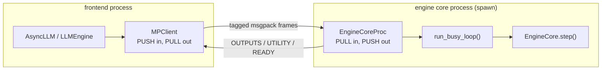

# 18. The multiprocess engine

> **Files:** [`pvllm/v1/engine/core_proc.py`](../../pvllm/v1/engine/core_proc.py), [`core_client_mp.py`](../../pvllm/v1/engine/core_client_mp.py), [`pvllm/v1/engine/__init__.py`](../../pvllm/v1/engine/__init__.py)
> **Upstream:** `vllm/v1/engine/core.py` (the `EngineCoreProc` half) and `core_client.py` (the `MPClient` half) — Tier B
> **Prerequisites:** chapters [16](16-clock-and-determinism.md), [17](17-engine-core-and-frontends.md).

```bash
PVLLM_ENABLE_V1_MULTIPROCESSING=1 pvllm serve --model dense-8b
```

Upstream defaults this **on**. This project defaults it **off**. Both defaults are right for
their engine, and understanding why is the point of the chapter.

## Why upstream does it

In real vLLM the engine core runs in a background process so that ZeroMQ socket IO and msgpack
serialization **overlap the GPU forward pass**. The GPU is busy for tens of milliseconds; doing
the CPU work concurrently is free throughput.

There is no GPU here, so that argument does not carry. Two others do.

**Serialization becomes real.** Every request is msgpack-encoded and decoded. A product that
sends something the wire format cannot carry finds out here, exactly as it would against real
vLLM — rather than getting away with it because the in-process client passed the object by
reference.

**Backpressure becomes real.** The sockets have real high-water marks and the core's busy loop
really does block. A frontend that outruns the engine hits the same wall.

## Why it is off by default here

It costs **byte-identical determinism**.

> In process, `LLM.generate` submits every prompt before the first step, so the batch composition
> is fixed and reproducibility holds byte for byte. Here the core steps whenever it has work, so
> whether request seven arrived before step three depends on OS scheduling. The engine's
> *decisions* are still deterministic given an arrival order — but the arrival order is not.

That is upstream's behaviour too. But determinism is load-bearing for this project: it is what
the conformance suite compares (chapter [29](29-conformance-and-fidelity.md)) and what makes two
runs of a sweep differ only in what was configured. So the conformance suite uses the in-process
client exclusively, and turning multiprocessing on is a deliberate act.

## The architecture



Two sockets, one child process, three frame tags in each direction.

### Frame types

```python
class EngineCoreRequestType(enum.Enum):
    ADD     = b"\x00"
    ABORT   = b"\x01"
    UTILITY = b"\x02"
    WAKEUP  = b"\x03"      # in-process sentinel, wakes a blocked input queue
```

Hex byte strings so the tag needs no encoding step of its own, matching upstream.

`ADD` and `ABORT` are the hot path. `UTILITY` is **everything else** — reading the engine's clock,
scraping stats, resetting the prefix cache — and it is a synchronous call/reply:

```python
class UtilityCall(msgspec.Struct, array_like=True, gc=False):
    call_id: int
    method: str
    args: list[Any] = []

class UtilityReply(msgspec.Struct, array_like=True, gc=False):
    call_id: int
    result: Any = None
    error: str | None = None
```

Correlated by `call_id` because the reply comes back **interleaved with output frames on the same
socket**, and matching by arrival order alone would break the first time two calls were in
flight.

Errors travel as **text** rather than being re-raised structurally: "a traceback from another
process is not reconstructable, and a string that names the method and the failure is more use
than a plausible-looking exception with the wrong traceback attached."

### The core process

```python
self.input_socket  = self.ctx.socket(zmq.PULL); self.input_socket.connect(input_address)
self.output_socket = self.ctx.socket(zmq.PUSH); self.output_socket.connect(output_address)

self._threads = [
    threading.Thread(target=self._read_input_socket,  name="pvllm-core-input",  daemon=True),
    threading.Thread(target=self._write_output_socket, name="pvllm-core-output", daemon=True),
]
```

Socket IO on its own threads and the step loop on the main one, as upstream does. Here it buys
**responsiveness** rather than overlap: a request arriving mid-step is queued immediately instead
of waiting for the step to end before anyone reads the socket.

```python
def run_busy_loop(self) -> None:
    while True:
        self._process_input_queue()
        if not self._running:
            break
        if not self.has_requests():
            continue
        outputs, _ = self.step()
        for client_outputs in outputs.values():
            self.output_queue.put((OUTPUTS, client_outputs))
```

`_process_input_queue` **blocks briefly when the engine is idle** (a bounded 20 ms wait), which is
what keeps a waiting engine off the CPU. Bounded rather than unbounded so the loop still notices
`_running` going false — an unbounded wait would need the shutdown path to deliver a wakeup
sentinel without ever racing, "which is more machinery than the 20 ms costs."

### Readiness at the transport level

```python
# Sent once startup (weight load, profiling, KV allocation) is complete
self.output_queue.put((READY, {"clock_time": self.clock.time()}))
```

The client's constructor returns only when that frame arrives, so the engine is *genuinely*
ready — readiness established at the transport level rather than by polling. And note the payload:
the client learns the core's clock from it immediately.

### `spawn`, not `fork`

```python
context = multiprocessing.get_context("spawn")
```

Spawn re-imports the main module in the child, which means a script that constructs an engine at
import time will construct it twice. The client's error message says so when it happens — this is
the standard multiprocessing footgun, and it is worth knowing before you hit it. Guard your entry
point with `if __name__ == "__main__":`.

## The clock across the boundary

This is the part the whole interface was shaped around.

In process, `clock_time` reads `engine_core.clock.time()` directly. Across a process boundary the
frontend cannot reach the clock at all — chapter [16](16-clock-and-determinism.md) puts it in the
core and nowhere else. So the frontend learns the time:

- from the `timestamp` on **every** outputs frame, and
- by an **explicit round trip** (a `UTILITY` call) when it needs a fresh one.

It is *cached* rather than round-tripped on every read, because reading the clock is on the hot
path of every `add_request`, and a synchronous round trip there would serialize the frontend
against the engine's step loop — "turning a modeled latency measurement into a measurement of
IPC."

The cache is exact where it matters anyway: per-request timing comes from the `QUEUED` and
`SCHEDULED` events the core stamps, not from the cached value. This is also why the output
processor prefers the core's `QUEUED` stamp over the frontend's arrival estimate (chapter
[17](17-engine-core-and-frontends.md)).

> Had the frontend ever reached for `time.time()` instead, in-process runs would have looked fine
> and this transport would have silently mixed two timelines.

## Two clients

| Class | For | `get_output` |
|---|---|---|
| `SyncMPClient` | `LLMEngine`, offline | blocking receive |
| `AsyncMPClient` | `AsyncLLM`, the server | a reader thread feeding an asyncio queue |

Both extend `MPClient`, which owns the sockets, the child process, the liveness check, and the
`call_id` counter. `_check_alive` is what turns a dead child into an `EngineDeadError` on every
in-flight request rather than a hang.

## Try it

```bash
PVLLM_ENABLE_V1_MULTIPROCESSING=1 pvllm serve --model dense-0.6b --max-model-len 2048
```

Then, from another terminal, the same requests as chapter [05](05-first-run.md). Everything works
identically — that is the point. To see the difference, run a workload twice each way:

```bash
python -c "
import os
os.environ['PVLLM_ENABLE_V1_MULTIPROCESSING'] = '0'
from pvllm.entrypoints.llm import LLM
from pvllm.sampling_params import SamplingParams
llm = LLM(model='dense-0.6b', max_model_len=512)
outs = llm.generate([f'prompt {i}' for i in range(8)], SamplingParams(max_tokens=8))
print('in-process steps:', llm.llm_engine.make_stats()['engine_step'])
"
```

In-process, that step count is the same every run. With multiprocessing on, it moves with the
machine's load — which is exactly the property the conformance suite cannot tolerate and a
realism test wants.

The test suite covers both: `tests/v1/test_engine_mp.py` exercises the transport, and it is the
file that had to be taught not to race the child on a loaded runner.

## Check yourself

- Name the two things multiprocessing makes *real* here, and the one it takes away.
- Why does upstream default it on and this project default it off?
- Why does a `UTILITY` call need a `call_id`?
- How does the frontend learn the engine's clock in this transport, and why is it cached?
- Why `spawn` rather than `fork`, and what does that mean for your entry point?

## Next

[19. The OpenAI server](19-openai-server.md) — the surface a product actually points at.
